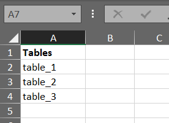

# Informatica-EDC-REST-API
Python scripts to fetch or update assets details using REST API in Informatica EDC

## Pre-requisites to run Python script in Linux Server:
1. Install Python 3.6 or above on your server if not available.
2. Must have Service Account that needs to be used for EDC REST API calls.
3. Following Python libraries are required that are used in Script: 
pandas, requests, html2text, openpyxl
4. If not present install the same using below commands:
  - pip3 install pandas --user
  - pip3 install requests --user
  - pip3 install html2text --user
  - pip3 install openpyxl --user
5. Authorization key for user account to be used in REST API call headers in Script. Refer encodeUser.py from below Github page to generate generate Authorization key: 
https://github.com/darren-wrigley/REST-API-Samples/tree/master/python

## fetchAssetDetails.py
1. To fetch details of Tables along with Columns present under it. It is useful when your Hundreds of tables are spread accross Resources and want to fetch details for the same.
2. It uses Excel file as input containing the list of Table names and output CSV is generated containing following details:   
Asset Id, Asset Name, Asset Type, Schema name, Business Description, Data Owner, Data Steward and Custom Attributes
3. Script takes "tables.xlsx" file as input and generate "AssetsExport.csv" as output.
4. Make sure above input file is present in same path as Script file.
5. Input file will contain the list of tables present in EDC for which details need to be fetched.
6. Find below screenshot for input file content format: 

